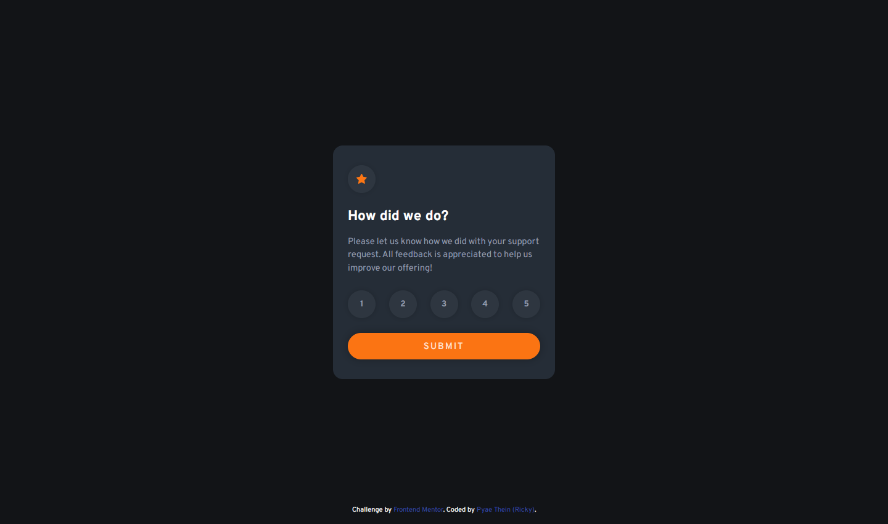

# Frontend Mentor - Interactive rating component solution

This is a solution to the [Interactive rating component challenge on Frontend Mentor](https://www.frontendmentor.io/challenges/interactive-rating-component-koxpeBUmI). Frontend Mentor challenges help you improve your coding skills by building realistic projects. 

## Table of contents

- [Overview](#overview)
  - [The challenge](#the-challenge)
  - [Screenshot](#screenshot)
  - [Links](#links)
- [My process](#my-process)
  - [Built with](#built-with)
  - [Continued development](#continued-development)
- [Author](#author)

## Overview

### The challenge

Users should be able to:

- View the optimal layout for the app depending on their device's screen size
- See hover states for all interactive elements on the page
- Select and submit a number rating
- See the "Thank you" card state after submitting a rating

### Screenshot

### Links

- Solution URL: https://github.com/pyaetheiN/Interactive-Rating-Component
- Live Site URL: https://pyaethein.github.io/Interactive-Rating-Component/

## My process

### Built with

- Semantic HTML5 markup
- CSS custom properties
- Flexbox
- CSS Grid
- Mobile-first workflow
- Vanilla JS

### Continued development

Getting comfortable with the basics of JS;
- saving items to `localStorage` and reusing them    
- js array methods such as `shift()` & `push()`
- `nextElementSibling` & `previousElementSibling`

## Author

- Frontend Mentor - [@pyaetheiN](https://www.frontendmentor.io/profile/pyaetheiN)
- Twitter - [@pt_boyyy](https://www.twitter.com/pt_boyyy)